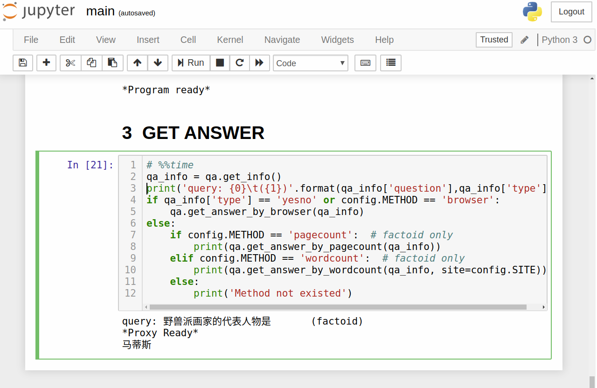
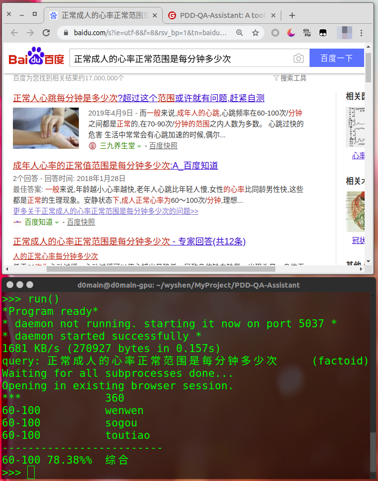

# PDD-QA-Assistant


### Description

A tool helps increase the probability to win Pinduoduo QA content.


### Software Architecture


├── cocurrent.py: modules to do search cocurrently  
├── config.py: configuration file  
├── helper.ipynb: some useful scripts while developing  
├── history_query.csv: history questions and their options and type  
├── img/: a folder to restore screenshots  
├── main.ipynb: the main notebook you need to run  
├── main.py:  the main python file you need to run  
├── parallel.py: methods to do search in perallel  
├── README.md: specialization  
├── requirements.txt: necessary dependencies  
├── run_cocurrent.py: scripts you might run in python shell to use coroutines  
├── run_parallel.py: scripts you might run in python shell to use multi-cores  
└── screenshot.py  


### Installation

#### Linux

**Install python, pip**

```bash
sudo apt install python3-pip python3-dev
```

 **Install necessary dependencies**

```bash
sudo pip install -r requirements.txt
```


### Configuration

- Methods

  - *wordcount*: compare the option occurences in search results.
    - `sogou`
    - `wenwen`
    - `360`
    - `zhidao`
    - `toutiao`
  - *pagecount*: compare the co-occurences (question and 2 options in individual)  in search (sogou search) results.
  - *browser*: open default browser and do web search (baidu search so far) using question as the keyword.

- IP Proxy

  you might use proxies provider you like. The `QA.get_ips()` is defined based on [蘑菇](http://www.moguproxy.com) API. You might rewrite it and place your proper api to the `Config.IP_PROXY_API`. If you're going to use current and static proxies, you need to assign them to the `Config.IP_POOL`.

### Instructions

1. get into the QA content 

2. main.ipynb, main.py, run_cocurrent.py, run_parallel.py

    To run `main.ipynb` in jupyter notebook while you are participating is recommanded. When the game comes to a new question like:  

  <div align=center></div>

  

   run the cell in `main.ipynb`, and it'll output the suggested answer.  

   <div align=center></div>

  


If you want a better result, to paste the code in `run_cocurrent.py` or `run_parallel.py`(**best effect**, shown as below) to python terminal(python shell) is not a bad choice. This script will help search the answer in at least 4 web search engine and open default browser in the mean time.
<div align=center></div>

### TODO
:black_square_button: History query match  
:black_square_button: Negative words detection. Probably see [Negative Words Dictionary](https://github.com/guotong1988/chinese_dictionary/blob/master/dict_negative.txt)
   

### Contribution
- If you like this repo, :heartbeat: please star:star2: it.
- If you have any problem, you may create an issue, and I'll check it out ASAP.


